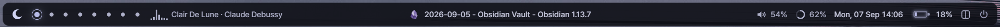
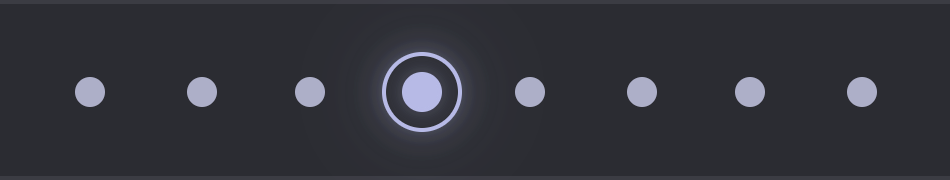
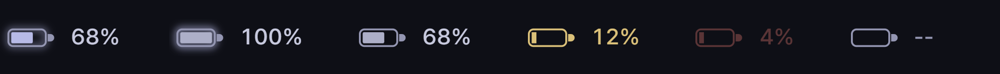
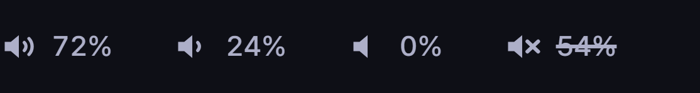
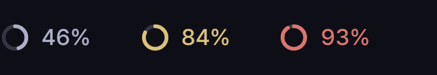
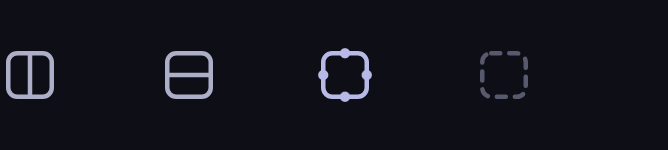
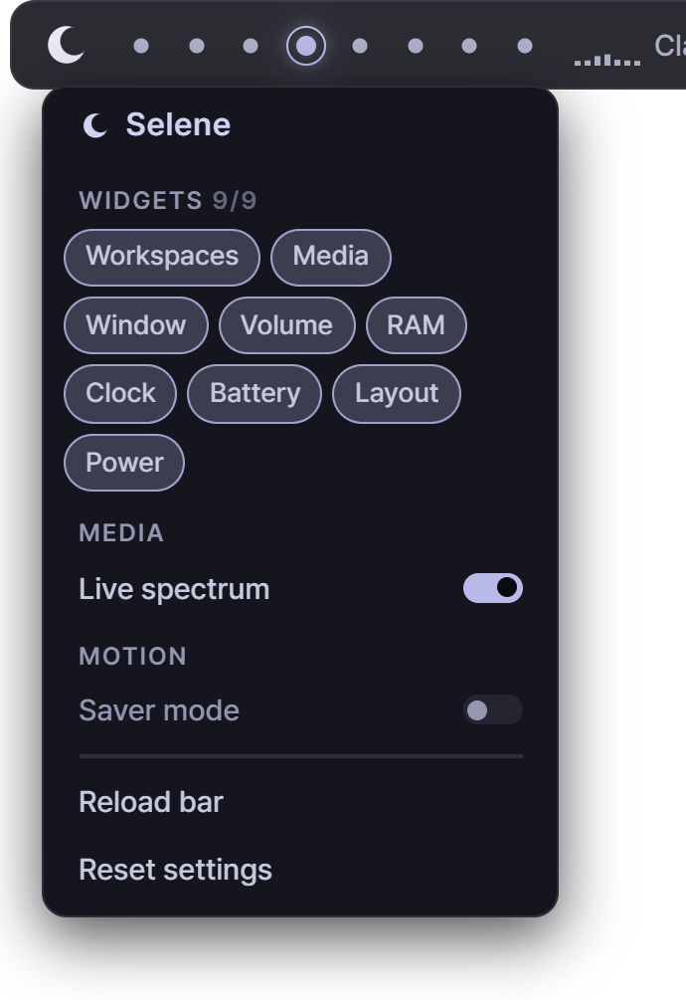
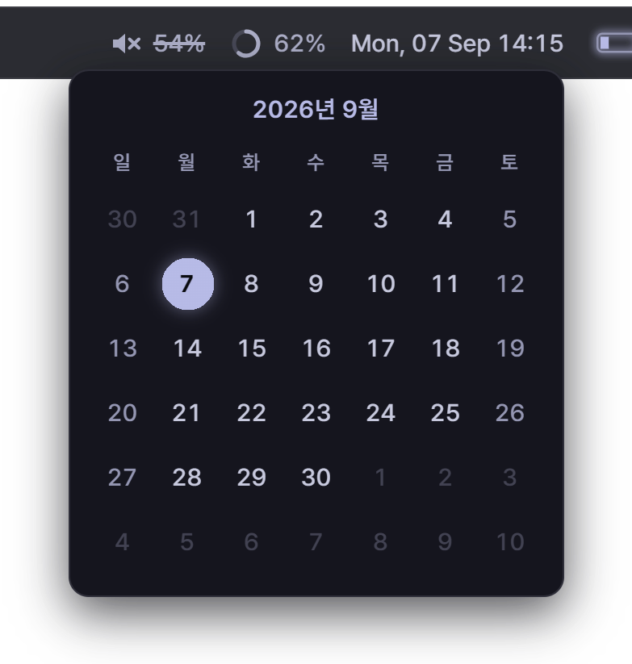
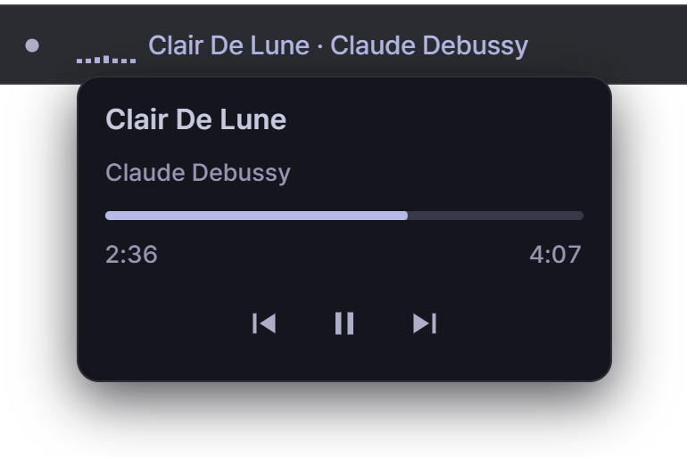
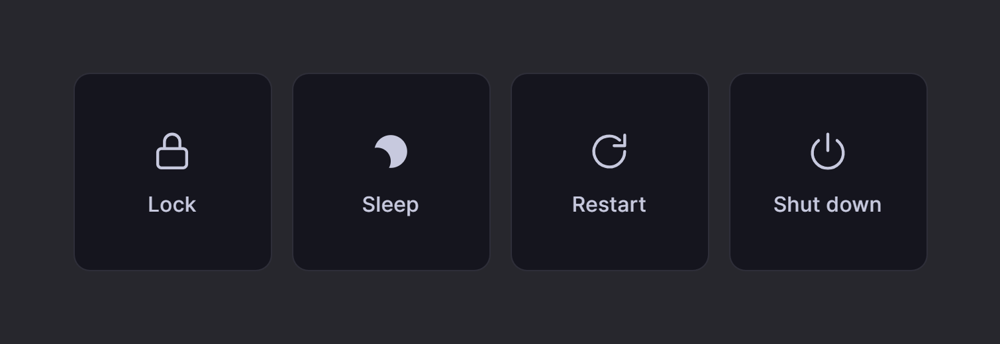

<div align="center">

<h1>selene-zebar</h1>

<p>A minimal <a href="https://github.com/glzr-io/zebar">Zebar</a> status bar for Windows, built for <a href="https://github.com/glzr-io/glazewm">GlazeWM</a>.</p>

<p>


</p>



</div>

Night-sky ground, moonlit silver, one hue throughout. Every mark is a drawn
SVG and the typeface ships with the pack, so there is nothing to install for it
to look the way it does here.

## What's in it

| Widget         | What it does                                                                                                                            |
| -------------- | --------------------------------------------------------------------------------------------------------------------------------------- |
| Workspaces     | One dot per GlazeWM workspace. Size says empty / has windows / displayed, and the focused one wears a ring and a halo. Click to switch. |
| Media          | What is playing, with an equaliser that runs while it plays. Click for the transport panel.                                             |
| Focused window | The window's own icon and its title, centred.                                                                                           |
| Volume         | Output level and a speaker that shows how loud. Click to mute.                                                                          |
| RAM            | A ring that fills with memory in use.                                                                                                   |
| Clock          | Date and time. Click for the month.                                                                                                     |
| Battery        | A gauge that fills with the charge, with a halo on mains.                                                                               |
| Layout         | Which way the next tiling window goes, whether a binding mode is on, and whether GlazeWM is paused. Click to flip the split direction.  |
| Power          | Lock, sleep, restart, shut down — the last two on a press-and-hold.                                                                     |



### States

States are colour, not just brightness. Amber is a caution and red is a
problem; nothing else in the bar leaves its one hue.

**Battery** — charging, full, discharging, low, critical, unknown



**Volume** — loud, quiet, silent, muted



**RAM** — normal, 80%, 90%



**Layout** — split sideways, split down, binding mode, paused



### Panels

| Settings                            | Calendar                            | Now playing                         | Power                         |
| ----------------------------------- | ----------------------------------- | ----------------------------------- | ----------------------------- |
|  |  |  |  |

## Requirements

|                                               |                                                         |
| --------------------------------------------- | ------------------------------------------------------- |
| [Zebar](https://github.com/glzr-io/zebar)     | 3.3.1+ — `winget install -e --id glzr-io.zebar`         |
| [GlazeWM](https://github.com/glzr-io/glazewm) | 3.10+ — `winget install -e --id glzr-io.glazewm`        |
| [cava](https://github.com/karlstav/cava)      | optional, 1.0+ — `winget install -e --id karlstav.cava` |

**Without GlazeWM the bar still runs.** The workspaces, the layout mark and the
focused-window readout hide themselves, `GLAZEWM OFFLINE` appears in their
place, and the clock, battery, volume, RAM, media and power widgets carry on as
normal.

**cava** is what lets the equaliser follow the sound coming out of the
speakers. Without it the bars fall back to an animation that is not driven by
anything, which is the default.

There is no build step and nothing to install for the bar itself — Zebar serves
the directory to WebView2 as it is. The one thing it fetches is Zebar's own
client from esm.sh, on first run only; the cache rule in `zpack.json` keeps
startup off the network after that.

## Install

Zebar loads packs from one level under `~/.glzr/zebar/`, taking the pack's id
from the folder name.

```powershell
git clone https://github.com/bmc00-05/selene-zebar `
  "$env:USERPROFILE\.glzr\zebar\selene-zebar"
```

Then name it in `~/.glzr/zebar/settings.json`:

```json
{
  "startupConfigs": [
    { "pack": "selene-zebar", "widget": "bar", "preset": "default" }
  ]
}
```

Restart Zebar (`zebar startup`, or the tray's **Exit** and launch again). To
have it come up with the session, GlazeWM's `startup_commands` is the usual
place:

```yaml
startup_commands: ['shell-exec cmd /c timeout /t 5 && zebar startup']
```

`shell-exec` does not pass its argument through a shell, so `&&` only chains
inside a `cmd /c` wrapper. Without it the line quietly does nothing.

## Settings

The crescent at the left end opens the panel.

- **Widgets** — a chip per widget, on or off. The bar comes up with the ones
  that are on already drawn, so nothing flashes into view and away again.
- **Live spectrum** — drives the equaliser from cava instead of the keyframes.
  Says `Cava not found` if the program is not installed.
- **Saver mode** — stops the animations that never end: the breathing halos,
  the equaliser, the marquee. Transitions still run, because they answer
  something and then stop. Two things it deliberately leaves alone — the
  equaliser holds its peaks so it still says whether something is playing, and
  the battery's critical pulse below 5% keeps going, because that one is a
  warning rather than an impression.
- **Reload bar** and **Reset settings** — the two ways back to a working bar.

Settings live in `localStorage`, which survives a reload and a Zebar restart
alike: the widget is served from a fixed origin.

To change how it looks, `bar/styles/tokens.css` holds every colour, length and
duration the bar uses, and nothing below that file writes a raw colour. The
clock's format is in `bar/components/clock.js`.

## Limitations

**Windows only.** Zebar is cross-platform; this pack is not — it shells out to
PowerShell for window icons and to `rundll32` for lock and sleep.

**Two numbers have to agree with GlazeWM.**

- `gaps.outer_gap` must be `4px`, the same as `--bar-inset-x/y`. The bar is an
  appbar and reserves its own strip, so GlazeWM never positions it; if the two
  differ, the gap above your windows and the gap around the bar stop matching.
- The preset height in `zpack.json` must equal `--bar-inset-y` plus
  `--bar-height` — 40px as shipped. Change the bar's height and both move.

**Developed and measured on one monitor, 1920×1080 at 125%.** Layout has been
checked by emulation from 1280 to 3840 wide. A second monitor is untested
ground, and one thing is known to be wrong there: the power overlay covers the
screen by moving the window to logical `(0, 0)`, which is the primary monitor's
origin rather than the one the bar is on.

**The typeface does not cover every script.** Pretendard draws Latin, Hangul,
Cyrillic, Greek, kana and the common symbols. Han characters — kanji and hanzi
— along with Arabic and Thai fall back to a system font, which stays readable
but will not match the rest of the bar.

**Two upstream quirks are worth knowing.**

- Zebar's battery provider does not recover if the machine sleeps: the device
  handle goes stale, the provider errors from then on, and the widget hides
  itself. Restarting Zebar brings it back.
- `shellSpawn(...).kill()` and `.write()` do not work in Zebar 3.3.1 — the
  client sends `processId` where the command expects `pid` — so anything this
  bar spawns is stopped by invoking the command directly. Without that
  workaround a killed process is simply left running.
- Zebar only reaps what a widget spawned when it exits cleanly. Force-killing
  it while **Live spectrum** is on leaves cava running, and cava keeps Zebar's
  local port bound through the handles it inherited — so the next Zebar starts
  with no server and the bar comes up blank. Quit from the tray, or kill cava
  along with it.

## Development

There is no bundler. Zebar serves the pack directory to WebView2 as-is, so
saving a file and reloading the widget is the whole edit loop.

```powershell
pnpm install       # prettier, and nothing else
pnpm format
pnpm run link      # symlink this repo into ~/.glzr/zebar (admin PowerShell)
```

`pnpm run link` is for working on the bar from a checkout elsewhere; it leaves
the code under version control while Zebar reads it in place. Pass `-DryRun` to
see what it would do.

Zebar widgets have no context menu, so DevTools is reached over WebView2's
remote debugging port:

```powershell
$env:WEBVIEW2_ADDITIONAL_BROWSER_ARGUMENTS = "--remote-debugging-port=9222"
Start-Process "C:\Program Files\glzr.io\Zebar\zebar.exe" `
  -ArgumentList 'start-widget-preset','--pack','selene-zebar','--widget-name','bar','--preset','default'
```

Then in Edge open `edge://inspect/#devices`, add `127.0.0.1:9222` under
**Configure**, and inspect the `selene-zebar` target. Editing a custom property
on `:root` in the Styles pane relays the whole bar at once, which is the fastest
way to settle a value before writing it into `tokens.css`.

Changing `zpack.json` needs Zebar restarted; a page reload will not pick it up.
Its `includeFiles` gates what the local server will hand out as well as what
gets packaged, so a new kind of file has to be listed there or requests for it
return 404.

<details>
<summary>Layout of the pack</summary>

```
zpack.json                pack manifest — widgets, presets, privileges
bar/
  index.html              the widget Zebar loads
  bar.js                  provider wiring; hands each tick to the components
  cava.conf               cava's side of the equaliser contract
  lib/
    css.js                reads tokens back out of CSS
    window.js             grows the widget window while a panel is open
    settings.js           what the bar remembers, published onto <html>
  components/
    workspaces.js         workspace indicators, reconciled by name
    media.js              equaliser, marquee, and the playback panel
    cava.js               drives the equaliser from real audio
    active-window.js      focused window's icon and title
    layout.js             tiling direction, binding mode, paused
    menu.js               the settings panel behind the mark
    volume.js             output volume; click to mute
    memory.js             RAM ring
    clock.js              clock; the date format lives here
    calendar.js           the month calendar behind the clock
    battery.js            battery gauge
    power.js              lock, sleep, restart, shut down
  fonts/                  the bundled typeface and its licence
  scripts/
    window-icon.ps1       extracts a window's icon, run through shellExec
  styles/                 one stylesheet per component, plus tokens.css
resources/                the images in this README
scripts/link.ps1          symlink into ~/.glzr/zebar
```

Components share one contract: `mount(root, zebar)` returns an `update(output)`
that takes the whole provider output and picks what it needs, including whether
to show itself. `bar.js` never learns what any of them reads, so adding a widget
is a provider line and a mount line.

</details>

## Design

Every colour sits at hue 278, a violet leaning blue, and only lightness and
chroma move — from `oklch(15% 0.013 278)` at the darkest to
`oklch(94% 0.016 278)` at the lightest. The accent is not a different colour,
just the highest chroma on the same ramp, which is why it reads as silver
carrying violet rather than as violet. The one exception is danger: amber and
red, worn by the RAM ring and the battery, because brightness can say "look
here" but not "this is going wrong".

Colours are written in `oklch()` because its lightness is perceptual — 68% →
76% → 84% are even steps to the eye where the same jumps in hex are not. They
all live in `bar/styles/tokens.css`, so swapping the palette is one file.

## License

[MIT](LICENSE) — the bar itself.

`bar/fonts/` carries [Pretendard](https://github.com/orioncactus/pretendard) by
Kil Hyung-jin under the [SIL Open Font License 1.1](bar/fonts/OFL.txt), which
travels with the font and stays in force wherever the pack goes.
